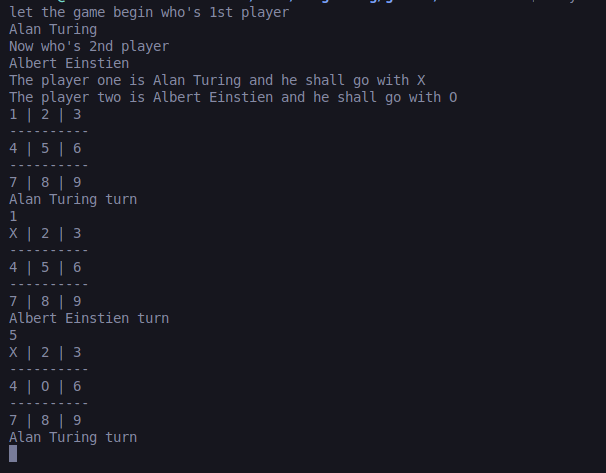

# Tic-Tac-Toe

Command line based implementation of the ruby tic tac toe game build with ruby

## Installation

- Clone the Repository
```
git clone git@github.com:sufiancodes/tic-tac-toe.git
```
## Navigate to Project directory
- cd tic-tac-toe
## Install Dependecies
- `bundle install`
## Run Main File
- `ruby main.rb`
## Output

